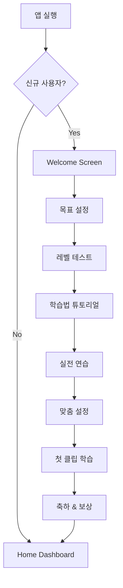

# Shortglish Onboarding PRD
**Product Requirements Document - User Onboarding Experience**

Version 1.0 | 2024.11

---

## 1. Executive Summary

### 1.1 목적
Shortglish의 핵심 학습 방법론을 효과적으로 전달하고, 사용자가 첫 학습을 성공적으로 완료하도록 가이드하여 장기 리텐션의 기반을 마련한다.

### 1.2 핵심 목표
- **이해**: 5단계 학습 시스템의 가치와 방법 이해
- **체험**: 각 단계를 직접 경험하며 효과 실감
- **동기부여**: 학습 가능성에 대한 확신 부여
- **습관 형성**: 일일 학습 루틴 설정

### 1.3 Success Metrics
- 온보딩 완료율: 70% 이상
- 첫 클립 완료율: 85% 이상
- D+1 리텐션: 60% 이상
- 온보딩 후 NPS: 50+ 

---

## 2. User Context & Problems

### 2.1 사용자 진입 맥락

#### **유입 경로별 기대치**
```yaml
SNS 광고 유입 (40%):
  기대: "30초로 영어 마스터" 약속 검증
  우려: 또 다른 영어 앱일까?
  
지인 추천 (30%):
  기대: 추천받은 기능 바로 체험
  우려: 나도 할 수 있을까?
  
앱스토어 검색 (20%):
  기대: 쉐도잉 특화 기능
  우려: 복잡하지 않을까?
  
콘텐츠 마케팅 (10%):
  기대: 발음 개선 솔루션
  우려: 이론만 있고 실천 어려울까?
```

### 2.2 첫 사용자의 불안 요소

#### **심리적 장벽**
1. **학습 방법 불확실성**: "어떻게 해야 하지?"
2. **실력 노출 두려움**: "내 발음이 창피한 수준이면?"
3. **시간 투자 우려**: "또 작심삼일 아닐까?"
4. **기술적 부담**: "너무 복잡하면 어쩌지?"

#### **경험적 편견**
- 기존 영어 앱 실패 경험
- 쉐도잉 독학 실패 기억
- 발음 교정 포기 경험

### 2.3 온보딩이 해결해야 할 핵심 과제

```
과제 1: "왜 다른가?" → 차별점 명확히 전달
과제 2: "할 수 있을까?" → 작은 성공 경험 제공
과제 3: "효과 있을까?" → 즉각적 개선 체감
과제 4: "계속할 수 있을까?" → 습관화 장치 설정
```

---

## 3. Onboarding Flow Architecture

### 3.1 전체 플로우 맵



### 3.2 단계별 소요 시간 및 이탈률 목표

| 단계 | 예상 시간 | 목표 완료율 | 허용 이탈률 |
|------|-----------|------------|------------|
| Welcome | 30초 | 95% | 5% |
| 목표 설정 | 1분 | 90% | 10% |
| 레벨 테스트 | 2분 | 85% | 15% |
| 학습법 튜토리얼 | 3분 | 80% | 20% |
| 실전 연습 | 2분 | 75% | 25% |
| 맞춤 설정 | 1분 | 73% | 27% |
| 첫 클립 학습 | 3분 | 70% | 30% |
| **전체** | **12분** | **70%** | **30%** |

---

## 4. Detailed Requirements by Step

### 4.1 Welcome Screen (진입)

#### **목적**
- 첫인상 형성
- 가치 제안 전달
- 계속 진행 동기 부여

#### **핵심 요소**
```yaml
비주얼:
  - 애니메이션 로고 (1.5초)
  - 핵심 메시지: "30초로 만드는 영어 기적"
  - 서브 메시지: "하루 30분, 3개월이면 자막 없이"

증명 요소:
  - 실 사용자 수: "15만명이 선택"
  - 평균 향상률: "3개월 평균 65% 향상"
  - 사용자 평점: "★4.8 (12,845개 리뷰)"

CTA:
  - 메인: "시작하기" (크고 명확하게)
  - 서브: "둘러보기" (작게, 옵션으로)
```

#### **스킵 옵션**
- 우상단 "건너뛰기" 제공
- 단, 첫 클립 학습은 필수

### 4.2 목표 설정 (Goal Setting)

#### **목적**
- 개인화된 경험 시작
- 명확한 목표 설정으로 동기부여
- 맞춤형 커리큘럼 데이터 수집

#### **구현 상세**
```yaml
질문 1 - 학습 목표:
  선택지:
    - 🎬 넷플릭스 자막 없이 보기
    - 💼 비즈니스 영어 구사
    - ✈️ 여행 영어 마스터
    - 🎓 시험 점수 향상
    - 💬 일상 회화 유창하게

질문 2 - 현재 수준:
  선택지:
    - 🥚 왕초보 (기초 단어만)
    - 🐣 초급 (간단한 문장)
    - 🐥 중급 (일상 대화 가능)
    - 🦅 고급 (유창함 향상)

질문 3 - 학습 가능 시간:
  선택지:
    - ⚡ 10분/일 (바쁜 일상)
    - 🎯 30분/일 (표준 권장)
    - 🚀 1시간+/일 (집중 학습)

결과 처리:
  - 맞춤 커리큘럼 생성
  - 일일 목표 클립 수 설정
  - 추천 학습 시간대 제안
```

### 4.3 레벨 테스트 (Level Test)

#### **목적**
- 정확한 실력 진단
- 맞춤형 난이도 설정
- 향상 가능성 제시

#### **테스트 구성**
```yaml
Part 1 - 듣기 (1분):
  - 10초 클립 3개
  - 난이도: 쉬움 → 보통 → 어려움
  - 자막 없이 들은 후 내용 선택

Part 2 - 발음 (1분):
  - 짧은 문장 3개 따라 읽기
  - AI 발음 분석
  - 즉시 피드백 제공

결과 화면:
  - 레벨: Beginner/Elementary/Intermediate/Advanced
  - 강점: "억양이 자연스러워요"
  - 개선점: "연음 연습이 필요해요"
  - 예상 성장: "3개월 후 예상 레벨"
```

### 4.4 학습법 튜토리얼 (Learning Method Tutorial)

#### **목적**
- 5단계 학습법 이해
- 각 단계의 중요성 인식
- 실행 자신감 부여

#### **단계별 설명 구조**
```yaml
각 단계 공통 구성:
  - 제목 & 아이콘
  - 목적 설명 (1문장)
  - 방법 설명 (시각적 가이드)
  - 체험 요소 (인터랙션)
  - 팁 제공

Step 1 - 자막 없이:
  인터랙션: Play 버튼 클릭 체험
  핵심 메시지: "먼저 귀를 열어보세요"

Step 2 - 영어 자막:
  인터랙션: 자막 등장 애니메이션
  핵심 메시지: "못 들은 부분 확인"

Step 3 - 한영 자막:
  인터랙션: 의미 매칭 드래그
  핵심 메시지: "상황과 의미 이해"

Step 4 - 발음 포인트: ⭐
  인터랙션: 클릭하면 발음 변화 표시
  핵심 메시지: "원어민의 발음 비밀"
  상세:
    - grab a → grabba (클릭 시 변환)
    - cup of → cuppa (음성 재생)
    - every → ev'ry (시각적 강조)

Step 5 - 쉐도잉:
  인터랙션: 마이크 버튼 애니메이션
  핵심 메시지: "완벽하게 따라하기"
```

### 4.5 실전 연습 (Practice Session)

#### **목적**
- 전체 프로세스 체험
- 성공 경험 제공
- 자신감 구축

#### **구현 요구사항**
```yaml
콘텐츠:
  - 쉬운 난이도 10초 클립
  - 성공 확률 높은 문장 선택
  - 예: "Good morning" 같은 친숙한 표현

진행 방식:
  - 5단계 축약 버전 (각 20초)
  - 가이드 오버레이 제공
  - 각 단계 완료 시 즉시 피드백

완료 보상:
  - 첫 성공 배지 획득
  - 정확도 점수 표시 (높게 나오도록 조정)
  - 격려 메시지: "훌륭해요! 벌써 70% 정확도!"
```

### 4.6 맞춤 설정 (Personalization)

#### **목적**
- 학습 루틴 설정
- 알림 허용 유도
- 개인화 완성

#### **설정 항목**
```yaml
학습 시간 설정:
  - 아침 (6-9시)
  - 점심 (12-13시)
  - 저녁 (18-20시)
  - 자기 전 (21-23시)
  
알림 설정:
  타이틀: "🔔 매일 같은 시간에 알려드릴게요"
  옵션:
    - 학습 리마인더
    - 복습 알림
    - 동기부여 메시지
  
  유도 문구: "알림을 켜면 학습 성공률이 3배 높아집니다"

관심 주제:
  - 일상 대화
  - 비즈니스
  - 여행
  - 영화/드라마
  - 뉴스/시사
```

### 4.7 첫 클립 학습 (First Clip Learning)

#### **목적**
- 실제 학습 경험
- 전체 프로세스 실행
- 완주 성취감

#### **클립 선정 기준**
```yaml
필수 조건:
  - 길이: 20-30초
  - 난이도: 사용자 레벨 -1
  - 일상 표현 중심
  - 발음 포인트 2-3개

추천 콘텐츠:
  초급: "Morning Coffee" (인사, 일상)
  중급: "Weekend Plans" (계획, 제안)
  고급: "Office Meeting" (비즈니스, 의견)

성공 보장 장치:
  - 힌트 버튼 제공
  - 속도 0.75x 기본 설정
  - 격려 메시지 다수 배치
```

### 4.8 축하 & 보상 (Celebration & Rewards)

#### **목적**
- 성취감 극대화
- 지속 동기 부여
- 공유 유도

#### **축하 화면 구성**
```yaml
비주얼:
  - 컨페티 애니메이션
  - 트로피 아이콘
  - 진동 피드백

메시지:
  메인: "🎉 첫 클립 완료!"
  서브: "당신은 이미 상위 30% 학습자입니다"

성과 요약:
  - 학습 시간: 3분 12초
  - 정확도: 75%
  - 획득 포인트: 100P
  - 연속 학습: 1일

보상:
  - 첫 클립 완료 배지
  - 100 포인트 지급
  - 프리미엄 1일 체험권

공유 유도:
  - "친구에게 자랑하기"
  - SNS 공유 시 추가 50P
```

---

## 5. Adaptive Onboarding Strategy

### 5.1 사용자 유형별 분기

#### **빠른 학습자 (Fast Track)**
```yaml
특징: 
  - 영어 중상급자
  - 앱 사용 익숙
  - 시간 부족

온보딩 조정:
  - 스킵 버튼 항상 표시
  - 레벨 테스트 후 바로 학습
  - 튜토리얼 최소화
  - 예상 시간: 5분
```

#### **신중한 학습자 (Careful)**
```yaml
특징:
  - 영어 초중급자
  - 자세한 설명 선호
  - 실패 두려움

온보딩 조정:
  - 각 단계 상세 설명
  - 연습 기회 추가
  - 힌트 많이 제공
  - 예상 시간: 15분
```

#### **탐험적 학습자 (Explorer)**
```yaml
특징:
  - 다양한 기능 관심
  - 자유로운 탐색 선호

온보딩 조정:
  - 선택적 경로 제공
  - 추가 콘텐츠 접근
  - 고급 기능 미리보기
  - 예상 시간: 10분
```

### 5.2 이탈 시점별 복구 전략

#### **이탈 포인트 분석 및 대응**

| 이탈 시점 | 예상 원인 | 복구 전략 | 구현 방법 |
|---------|-----------|----------|-----------|
| Welcome | 가치 불명확 | 즉시 가치 제시 | 3초 내 핵심 메시지 |
| 목표 설정 | 선택 피로 | 기본값 제공 | "잘 모르겠어요" 옵션 |
| 레벨 테스트 | 부담/창피 | 스킵 허용 | "나중에 하기" 버튼 |
| 튜토리얼 | 지루함 | 인터랙션 강화 | 게임 요소 추가 |
| 실전 연습 | 어려움 | 난이도 조정 | 실시간 힌트 제공 |
| 첫 클립 | 실패 두려움 | 성공 보장 | 쉬운 클립 선택 |

### 5.3 재진입 사용자 온보딩

```yaml
24시간 내 재진입:
  - 중단 지점부터 이어하기
  - "돌아오신 것을 환영해요!"
  - 10% 추가 포인트 보너스

7일 내 재진입:
  - 간소화된 온보딩
  - 핵심 기능만 설명
  - 복귀 보상 제공

30일 후 재진입:
  - 새 기능 하이라이트
  - 리뉴얼 온보딩
  - 컴백 이벤트 제공
```

---

## 6. Technical Requirements

### 6.1 퍼포먼스 요구사항

```yaml
로딩 시간:
  - 초기 로딩: < 2초
  - 단계 전환: < 0.5초
  - 비디오 로딩: < 1초

애니메이션:
  - 60 FPS 유지
  - 부드러운 전환
  - 하드웨어 가속 활용

오프라인 지원:
  - 온보딩 콘텐츠 사전 캐싱
  - 네트워크 없이도 진행 가능
```

### 6.2 분석 이벤트 트래킹

```yaml
필수 이벤트:
  - onboarding_start
  - onboarding_step_complete
  - onboarding_skip
  - onboarding_complete
  - first_clip_start
  - first_clip_complete

상세 파라미터:
  - step_name: 현재 단계
  - duration: 소요 시간
  - skip_point: 스킵 시점
  - error_type: 오류 발생 시
  - user_path: 선택 경로
```

### 6.3 A/B 테스트 계획

```yaml
테스트 1 - 온보딩 길이:
  A: 전체 온보딩 (12분)
  B: 간소화 온보딩 (5분)
  측정: 완료율, D+7 리텐션

테스트 2 - 레벨 테스트 위치:
  A: 온보딩 초반
  B: 온보딩 후
  측정: 이탈률, 정확도

테스트 3 - 보상 시점:
  A: 각 단계마다
  B: 최종 완료 시만
  측정: 완료율, 만족도
```

---

## 7. Success Metrics & KPIs

### 7.1 Primary Metrics

| 지표 | 목표 | 측정 방법 | 주기 |
|-----|------|----------|-----|
| 온보딩 완료율 | 70% | 완료 사용자/시작 사용자 | 일간 |
| 첫 클립 완료율 | 85% | 클립 완료/온보딩 완료 | 일간 |
| Time to Value | <5분 | 첫 성공 체험까지 시간 | 세션 |
| D+1 리텐션 | 60% | 다음날 재방문율 | 일간 |
| D+7 리텐션 | 40% | 7일 후 활성 사용자 | 주간 |

### 7.2 Secondary Metrics

```yaml
참여도 지표:
  - 평균 온보딩 시간: 8-12분
  - 단계별 이탈률: <5% per step
  - 스킵 사용률: <20%
  - 재시도율: >30%

만족도 지표:
  - 온보딩 NPS: 50+
  - 앱스토어 평점: 4.5+
  - 추천 의향: 70%+
  - 피드백 긍정률: 80%+

기술 지표:
  - 크래시율: <0.1%
  - 로딩 실패: <1%
  - 비디오 버퍼링: <2초
```

---

## 8. Risk Mitigation

### 8.1 리스크 매트릭스

| 리스크 | 영향도 | 확률 | 대응 방안 |
|--------|-------|------|----------|
| 너무 긴 온보딩 | 높음 | 중간 | Progressive Disclosure |
| 기술적 이슈 | 높음 | 낮음 | Fallback UI 준비 |
| 레벨 테스트 거부 | 중간 | 중간 | 선택적 진행 |
| 마이크 권한 거부 | 중간 | 높음 | 대체 학습 모드 |
| 콘텐츠 로딩 실패 | 높음 | 낮음 | 오프라인 샘플 준비 |

### 8.2 Fallback 시나리오

```yaml
마이크 권한 없음:
  - 듣기 중심 모드 제공
  - 나중에 설정 유도
  - 제한적 기능으로 진행

네트워크 불안정:
  - 오프라인 콘텐츠 사용
  - 저화질 비디오 옵션
  - 텍스트 중심 진행

앱 크래시:
  - 진행 상태 자동 저장
  - 재시작 시 복구
  - 보상으로 동기부여
```

---

## 9. Post-Onboarding Strategy

### 9.1 Day 1-7 Journey

```yaml
Day 1:
  - 첫 클립 완료 축하 푸시
  - 두 번째 클립 추천
  - 팁 이메일 발송

Day 2:
  - 연속 학습 독려
  - 쉬운 난이도 유지
  - 작은 보상 제공

Day 3:
  - 첫 복습 안내
  - 발음 개선 피드백
  - 진도 리포트

Day 7:
  - 주간 성과 요약
  - 레벨 업 가능성 제시
  - 프리미엄 할인 제공
```

### 9.2 습관 형성 전략

```yaml
트리거 설정:
  - 같은 시간 알림
  - 위젯 배치 유도
  - 잠금화면 리마인더

루틴 구축:
  - 아침 첫 클립
  - 점심 복습
  - 저녁 새 학습

보상 강화:
  - 일일 포인트
  - 연속 배지
  - 주간 리더보드
```

---

## 10. Implementation Roadmap

### Phase 1: MVP (Week 1-2)
- 기본 플로우 구현
- 핵심 5단계 튜토리얼
- 첫 클립 학습

### Phase 2: Enhancement (Week 3-4)
- 애니메이션 추가
- 개인화 요소
- A/B 테스트 설정

### Phase 3: Optimization (Week 5-6)
- 데이터 기반 개선
- 이탈 구간 최적화
- 재진입 플로우

### Phase 4: Scale (Week 7-8)
- 다국어 지원
- 고급 개인화
- 소셜 기능 연동

---

## Appendix

### A. Competitor Onboarding Analysis

| 앱 | 장점 | 단점 | 차별화 포인트 |
|----|-----|------|--------------|
| Duolingo | 게임화 우수 | 너무 길고 반복적 | 5단계 명확성 |
| Cake | 간단명료 | 학습법 설명 부족 | 발음 포인트 강조 |
| 스픽 | AI 활용 | 기술 장벽 높음 | 단순하지만 효과적 |

### B. User Research Insights

```yaml
인터뷰 핵심 발견:
  - "첫날이 제일 중요해요"
  - "너무 복잡하면 바로 삭제"
  - "작은 성공이라도 느끼고 싶어요"
  - "왜 이렇게 해야 하는지 알려주세요"
```

### C. Design Principles

1. **Show, Don't Tell**: 설명보다 체험
2. **Progressive Disclosure**: 단계적 정보 제공
3. **Celebration Moments**: 작은 성공도 축하
4. **Safe to Fail**: 실패해도 괜찮은 환경
5. **Personal Touch**: 개인화된 경험

---

*"First Time Right, Every Time Delight"*